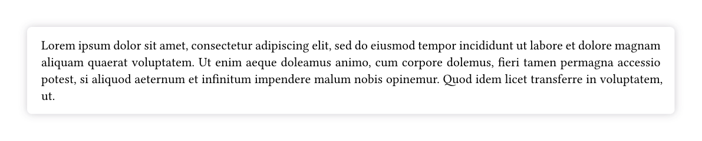

# shadowed

Box shadows for [Typst](https://typst.app/).

## Example

```typ
#import "@preview/shadowed:0.1.0": shadowed

#set par(justify: true)

#shadowed(radius: 4pt, inset: 12pt)[
    #lorem(50)
]
```



## Credits

This project was inspired by [Harbinger](https://github.com/typst-community/harbinger).
